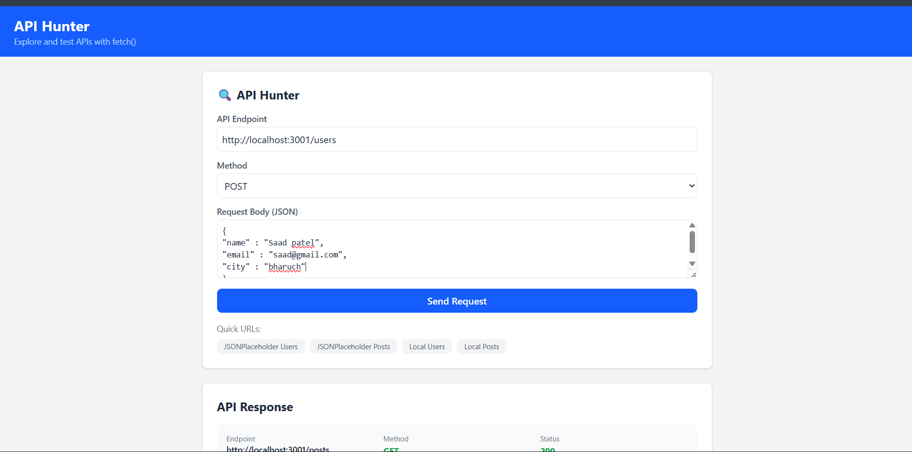
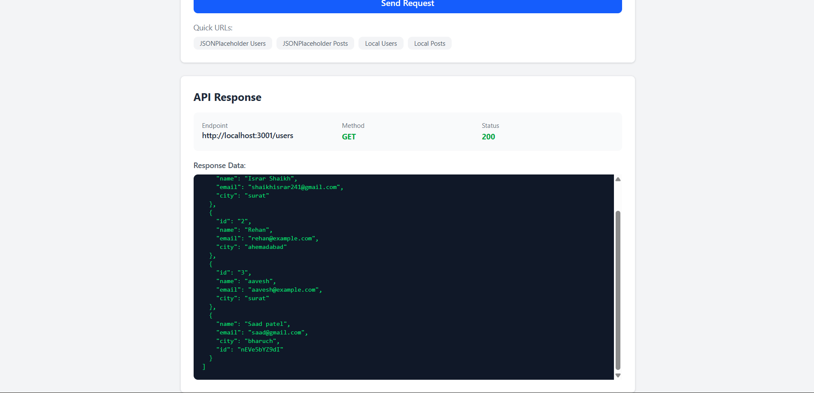
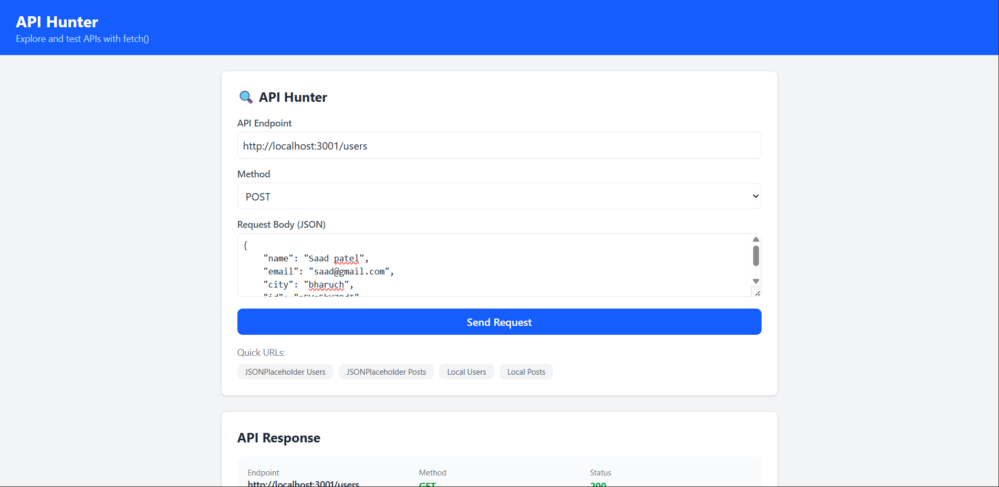

# 🔍 API Hunter

A React + Redux based application to explore and test APIs using fetch().

## 📝 Project Description

API Hunter allows users to make GET and POST requests to any API endpoint. It uses Redux Toolkit for state management and JSON Server as a mock backend.

## 🧩 Component Structure

- **store.js** — Redux store
- **apiSlice.js** — API state management with createAsyncThunk
- **ApiForm.jsx** — API endpoint input form
- **ApiResponse.jsx** — Response display component

## ⚛️ Tech Stack

- React
- Redux Toolkit
- fetch() API
- JSON Server
- Tailwind CSS

## 🔥 Features

- GET requests
- POST requests
- Loading state
- Error handling
- JSON Server mock backend
- Quick URL buttons
- Response status display
- Formatted JSON response

## 📸 Screenshots

### GET Request


### POST Request


### JSON Server


## ⚙️ How To Run
```bash
# Install dependencies
npm install

# Run React app
npm run dev

# Run JSON Server (new terminal)
npx json-server --watch db.json --port 3001
```

## 📌 Notes

- JSON Server runs on port 3001
- React app runs on port 5173
- No external backend needed