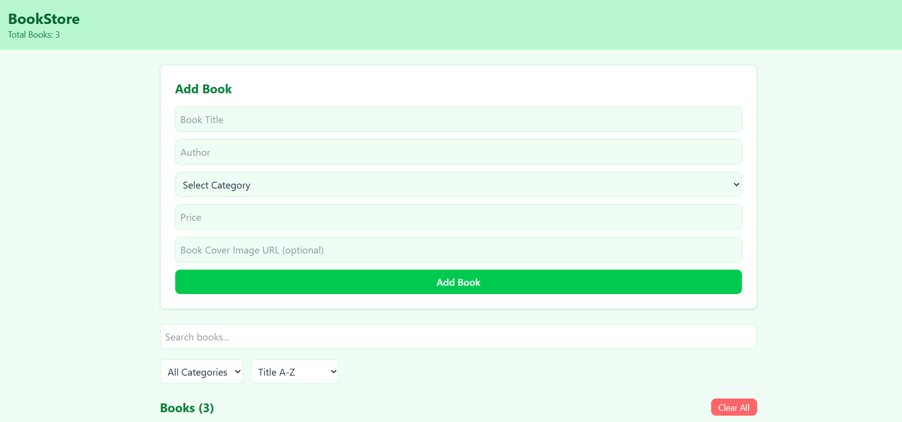
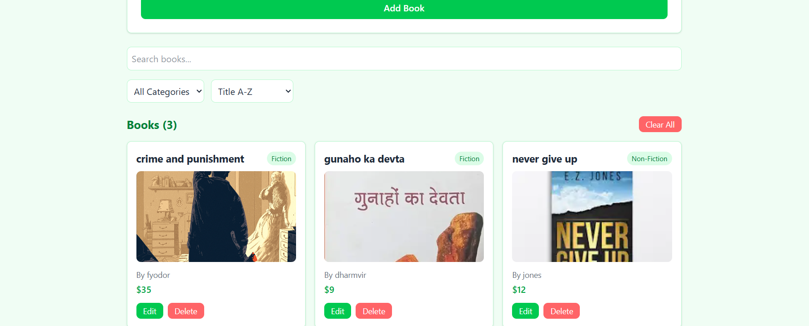

# 📚 BookStore

A React-based book management application with CRUD, Search, Filter, and Sort.

## 📝 Project Description

BookStore allows users to add, edit, and delete books while searching, filtering by category, and sorting by title or price. Data persists locally using localStorage.

## 🧩 Component Structure

- **App.jsx** — Central state management
- **BookForm.jsx** — Add/Edit books
- **BookList.jsx** — Display all books
- **BookCard.jsx** — Single book card
- **SearchBar.jsx** — Search books
- **FilterSort.jsx** — Filter and sort books

## ⚛️ React Concepts Used

- useState
- useEffect
- Props
- Events & Handlers
- Conditional Rendering
- List Rendering
- localStorage Integration
- Filter + Search + Sort Logic

## 📸 Screenshots

### Add Book Form


### Book List



## ⚙️ How to Run
```bash
npm install
npm run dev
```

## 📌 Notes

- Data persists until manually cleared
- No backend or API used