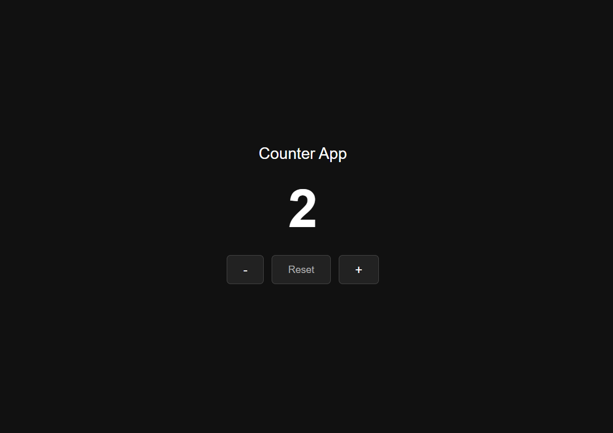

<<<<<<< HEAD
# Counter App

A simple counter application built with React and useState hook.

## Features

- Increment counter with `+` button
- Decrement counter with `-` button
- Reset counter to 0 with `Reset` button

## Tech Used

- React
- useState Hook
- CSS

## How to Run

```bash
npm install
npm run dev
```

Then open `http://localhost:5173` in your browser.

## Project Structure

```
src/
├── App.jsx       # Main component with counter logic
└── App.css       # Styling
```

## What I Learned

- How to use `useState` to store and update data
- How to handle button click events with `onClick`
- How to use arrow functions inside event handlersin

## Screenshots


=======
# React-JS
>>>>>>> refs/rewritten/fix-merge
