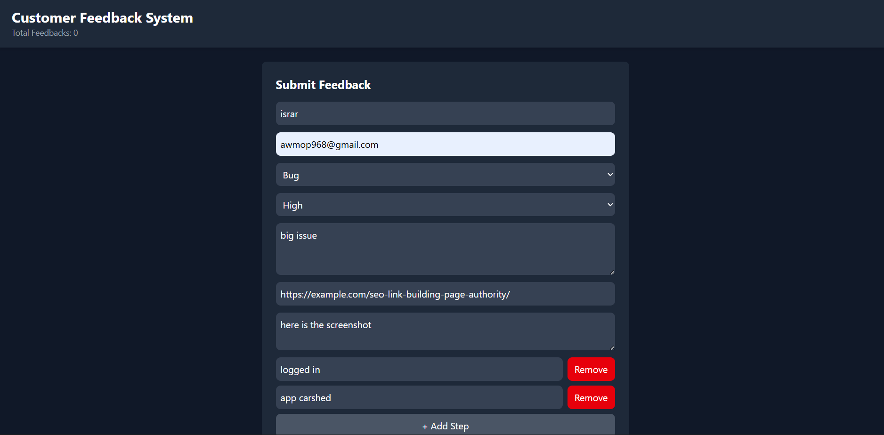
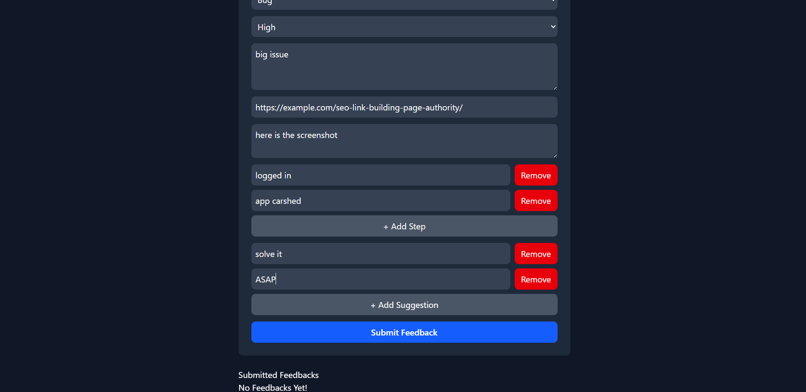
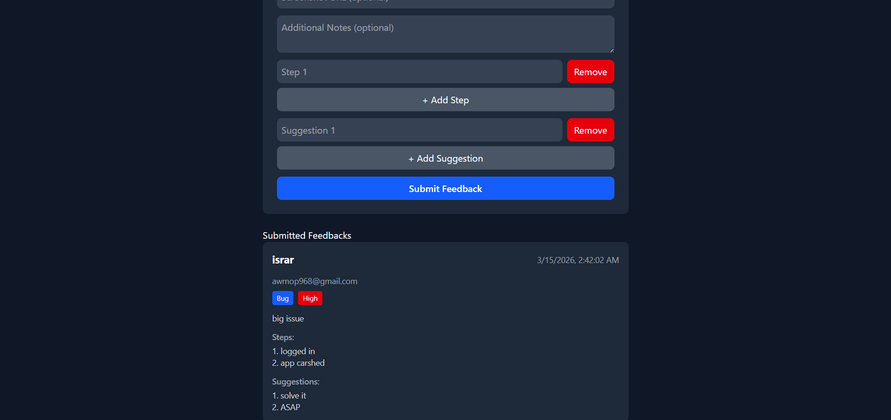

# 💬 Customer Feedback & Issue Reporting System

A React-based interactive application for collecting structured feedback and issue reports.

## 📝 Project Description

The Customer Feedback & Issue Reporting System allows users to submit complaints, suggestions, bug reports, and improvement ideas through a fully interactive and validated form. Submitted feedback is displayed instantly in a review dashboard.

## 🚀 Features

- Complete feedback submission form
- Controlled & Uncontrolled components
- Dynamic form rows (add/remove steps & suggestions)
- Form validation
- Feedback dashboard
- Real-time UI updates

## 🧩 Component Structure

- **App.jsx** — Main component, manages all state and functions
- **FeedbackForm.jsx** — Form handling, controlled/uncontrolled logic
- **DynamicList.jsx** — Reusable dynamic field component
- **FeedbackList.jsx** — Renders all submitted feedback
- **FeedbackCard.jsx** — Single feedback card component

## ⚛️ React Concepts Used

- useState
- useRef
- Props
- Events & Handlers (onChange, onSubmit, onClick, onBlur, onFocus)
- Controlled Components
- Uncontrolled Components
- Conditional Rendering
- List Rendering (map + keys)
- Fragments
- Dynamic Form Fields

## 📸 Screenshots







## 🛠️ Tech Stack

- React
- Vite
- Tailwind CSS

## ⚙️ How to Run
```bash
npm install
npm run dev
```

## 📌 Notes

- No backend or localStorage used
- All data resets on refresh