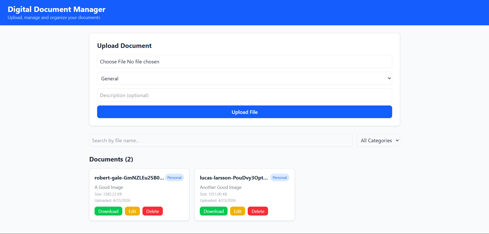
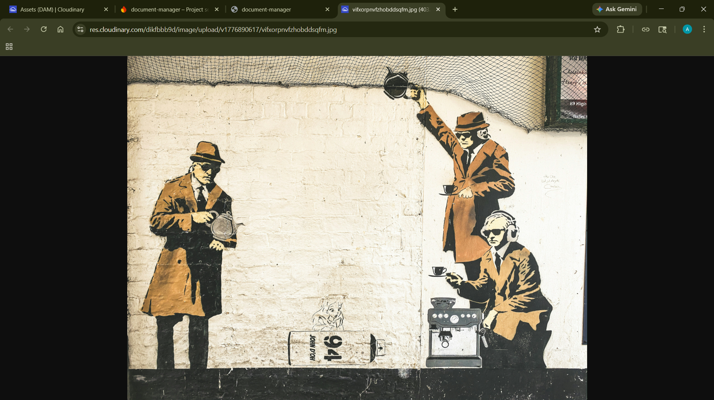
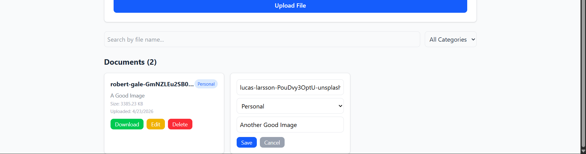
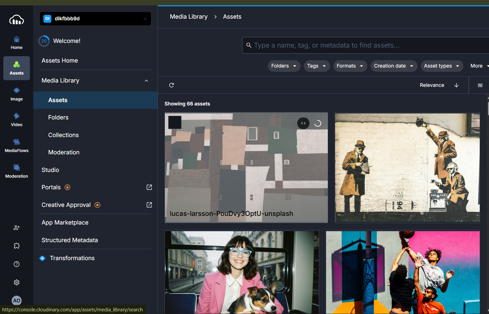
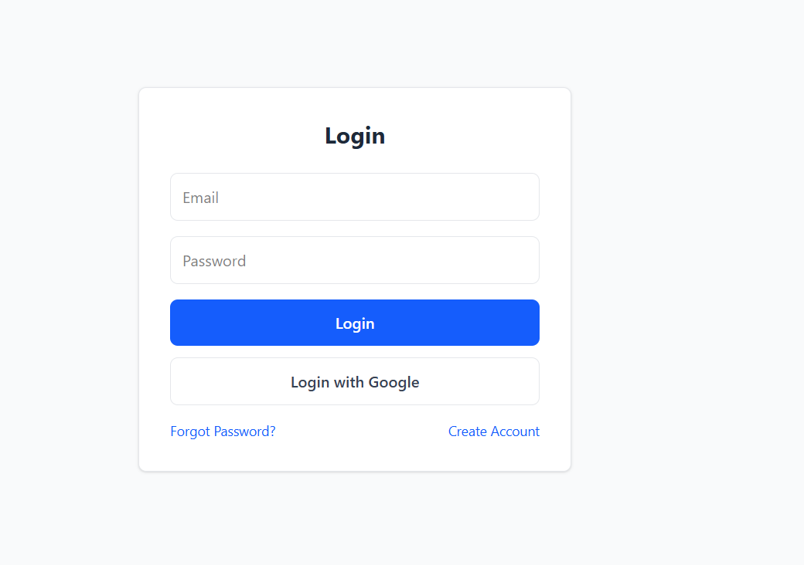
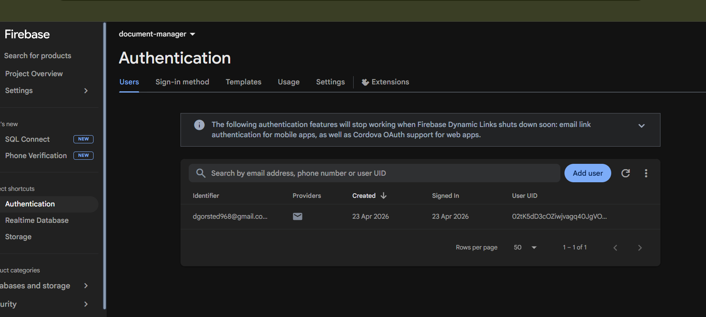

# 📁 Digital Document Manager

A React + Redux + Firebase + Cloudinary based document management application.

## Note

Firebase Storage requires Blaze plan upgrade.
As an alternative, Cloudinary (free tier) is used
for file storage while Firebase Realtime Database
stores file metadata.

## 📝 Project Description

Digital Document Manager allows users to upload, organize, preview, and delete digital documents. Files are stored on Cloudinary while metadata is managed in Firebase Realtime Database.

## 🧩 Component Structure

- **store.js** — Redux store
- **fileSlice.js** — File state management
- **firebaseConfig.js** — Firebase configuration
- **UploadFile.jsx** — File upload component
- **FileList.jsx** — Display all files
- **FileCard.jsx** — Single file card
- **SearchFilter.jsx** — Search and filter
- **Dashboard.jsx** — Main dashboard

## ⚛️ Tech Stack

- React
- Redux Toolkit
- Firebase Realtime Database
- Cloudinary
- Tailwind CSS

## 🔥 Features

- Upload documents
- View all documents
- Edit file details
- Delete files
- Search by name
- Filter by category
- Real-time sync with Firebase

## 🔐 Authentication Features

- Email/Password Registration
- Email/Password Login
- Google Social Login
- Forgot Password (Email Reset)
- Protected Routes
- Profile Management
- Password Change
- Real-time Auth State

## 📸 Screenshots














## ⚙️ How To Run

```bash
npm install
npm run dev
```

## 📌 Notes

- Files stored on Cloudinary
- Metadata stored in Firebase
- No backend needed
