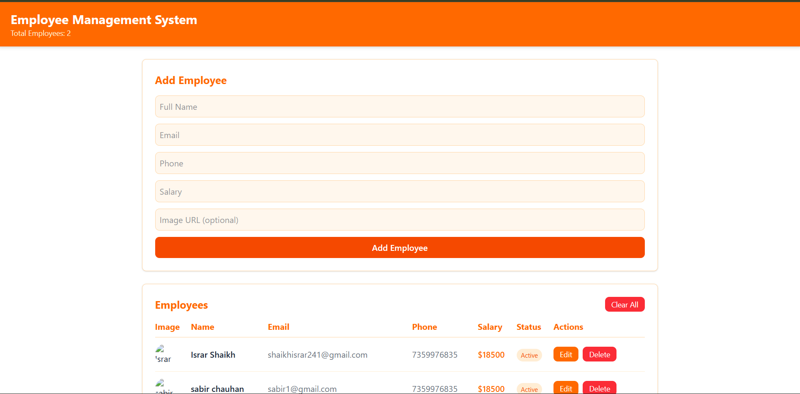
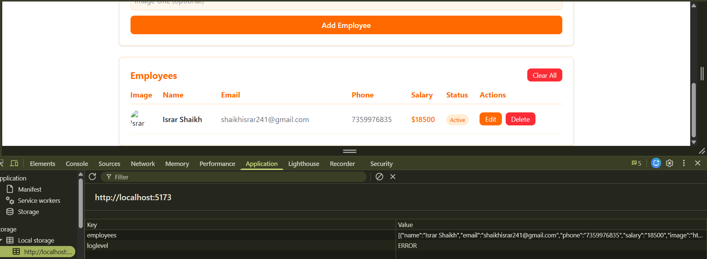

# 👥 Employee Management System

A React-based offline CRUD application for managing employee records.

## 📝 Project Description

Employee Management System allows users to add, edit, and delete employee records while persisting data locally using localStorage.

## 🧩 Component Structure

- **App.jsx** — Central state management
- **EmployeeForm.jsx** — Add/Edit employees
- **EmployeeList.jsx** — Display all employees
- **EmployeeRow.jsx** — Single employee row

## ⚛️ React Concepts Used

- useState
- useEffect
- Props
- Events & Handlers
- Conditional Rendering
- List Rendering
- localStorage Integration
- Form Validation

## 📸 Screenshots




## ⚙️ How to Run
```bash
npm install
npm run dev
```

## 📌 Notes

- Data persists until manually cleared
- No backend or API used