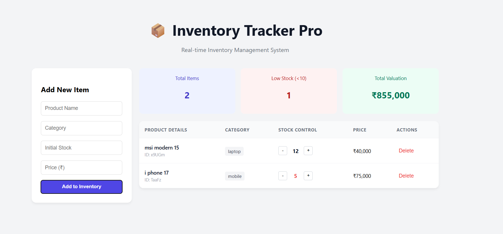
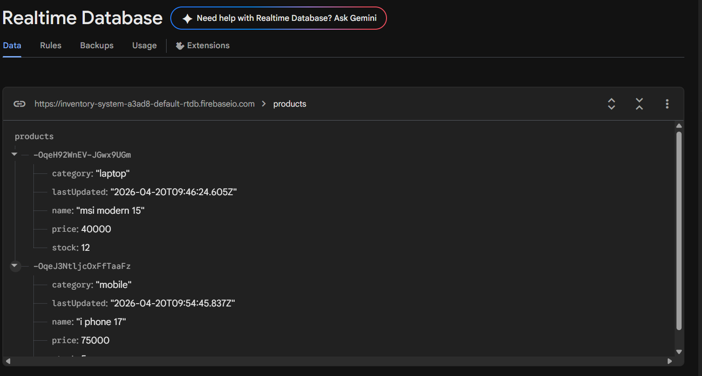

# 📦 Inventory Tracking System (Real-time)

A professional, industry-ready inventory management application built with **React.js**, **Redux Toolkit**, and **Firebase Realtime Database**. This system allows businesses to manage products, track stock levels, and monitor total valuation in real time.

---

## 🚀 Live Preview

*Figure 1: Main Dashboard with Real-time Stats*


*Figure 2: CRUD Operations and Low Stock Alerts*

---

## ✨ Features

- **Real-Time Synchronization**: Any update in the Firebase database reflects instantly across all connected clients without page refresh.
- **Full CRUD Operations**:
  - **Create**: Add new products with name, category, initial stock, and price.
  - **Read**: View all inventory items in an organized, responsive data table.
  - **Update**: Precise stock control with increment/decrement buttons.
  - **Delete**: Remove discontinued or out-of-catalog products with ease.
- **Smart Dashboard & Analytics**:
  - **Total Valuation**: Automatically calculates the total value of all stock (Price × Quantity).
  - **Low Stock Alerts**: Highlights products with stock levels below 10 units in red.
  - **Quick Stats**: At-a-glance view of total items and low-stock warnings.

---

## 🛠️ Tech Stack

- **Frontend**: React.js (Hooks, Functional Components)
- **State Management**: Redux Toolkit (Slices & Thunks)
- **Backend**: Firebase Realtime Database
- **Middleware**: Redux Thunk (Asynchronous Listener for Live Sync)
- **Styling**: Modern CSS-in-JS (Responsive Design)

---

## ⚙️ Installation & Setup

1. **Clone the repository**
   ```bash
   git clone [https://github.com/your-username/inventory-tracker.git](https://github.com/your-username/inventory-tracker.git)
   cd inventory-tracker