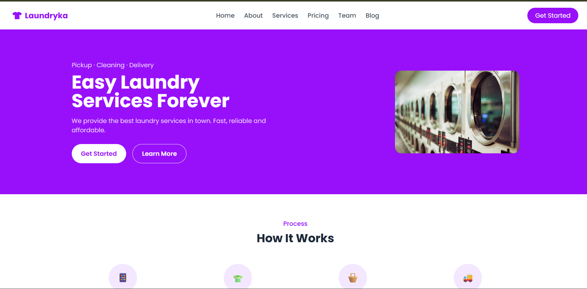
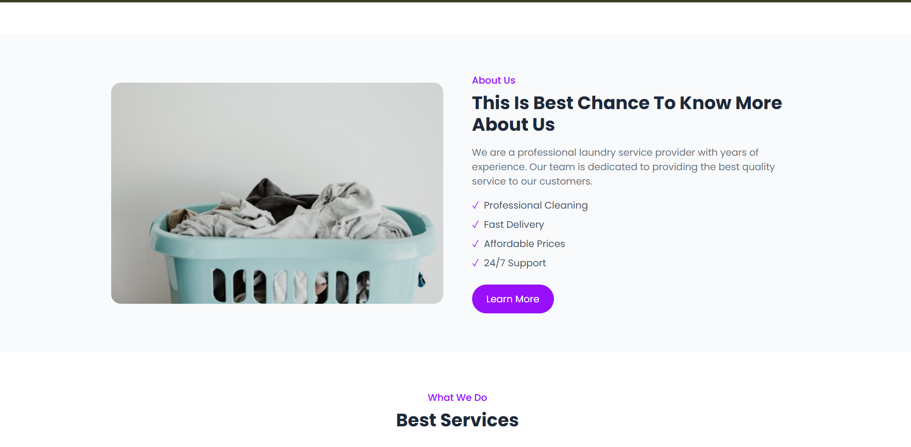
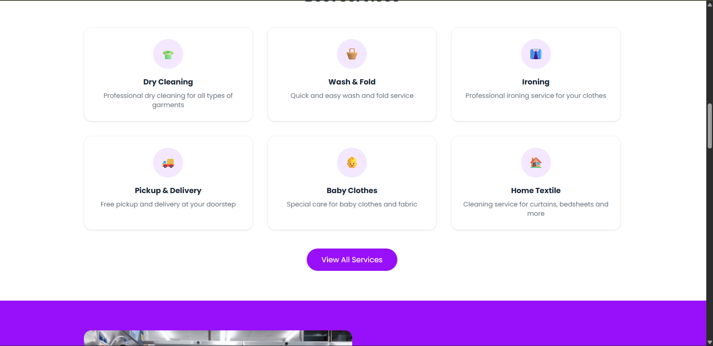
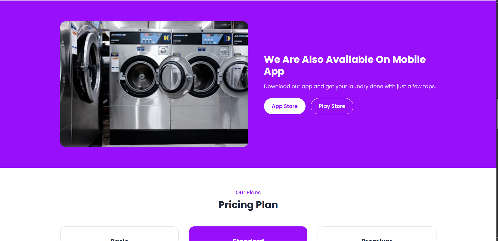
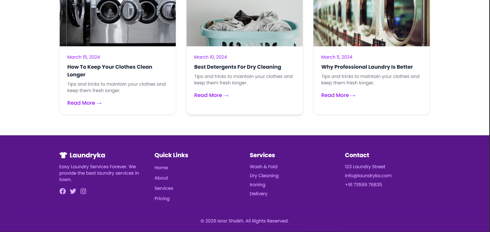

# 🧺 Laundryka — Professional Dry Cleaning & Laundry Services Website

A modern, multi-page React.js website inspired by the Laundryka PSD template from ThemeForest.

> 🔗 **Inspired From:** [Laundryka - Dry Cleaning Services PSD Template](https://themeforest.net/item/laundryka-dry-cleaning-services-psd-template/27161431) on ThemeForest

---

## 📝 Project Description

Laundryka is a fully responsive, multi-page laundry service website built using React.js and React Router DOM. The project replicates the design and layout of the Laundryka ThemeForest template, featuring a clean purple and white color scheme with modern UI components.

The website includes 8 complete pages, a responsive Navbar, and a detailed Footer — all built using React components and styled with Tailwind CSS.

---

## 🌐 Pages Included

| Page | Description |
|------|-------------|
| 🏠 Home | Hero section, How It Works, About, Services, App Banner, Pricing, Stats, Team, Newsletter, Blog |
| 👥 About | Company story, stats counter, mission statement |
| 🧹 Services | All 6 services with descriptions and pricing |
| 💰 Pricing | 3 pricing plans with FAQ section |
| 👨‍💼 Team | 8 team members with roles |
| 📝 Blog | 6 blog posts in grid layout |
| 📄 Blog Detail | Individual blog post page |
| 📞 Contact | Contact form + contact information |

---

## ⚛️ Tech Stack

| Technology | Usage |
|------------|-------|
| React.js | Frontend framework |
| React Router DOM | Multi-page navigation |
| Tailwind CSS | Styling and layout |
| React Icons | Icons throughout the website |
| Vite | Build tool |

---

## 🧩 Project Structure
```
src/
├── components/
│    ├── Navbar.jsx
│    └── Footer.jsx
├── pages/
│    ├── Home.jsx
│    ├── About.jsx
│    ├── Services.jsx
│    ├── Pricing.jsx
│    ├── Team.jsx
│    ├── Blog.jsx
│    ├── BlogDetail.jsx
│    └── Contact.jsx
├── assets/
│    ├── home-page/
│    └── screenshots/
└── App.jsx
```

---

## ⚙️ How To Run
```bash
# Clone the repository
git clone https://github.com/your-username/laundry-website.git

# Go to project folder
cd laundry-website

# Install dependencies
npm install

# Start development server
npm run dev
```

---

## 📸 Screenshots











---

## ✨ Key Features

- Multi-page navigation with React Router
- Responsive Navbar with active links
- Hero section with call-to-action buttons
- Services grid layout
- Pricing plans with featured card
- Team members section
- Blog posts with detail page
- Contact form
- Newsletter subscription
- Stats counter section
- App download banner
- Detailed Footer with links

---

## 📌 Notes

- This project is inspired by the Laundryka ThemeForest template
- All images used are from the template assets
- No backend or API used
- Built purely with React + Tailwind CSS