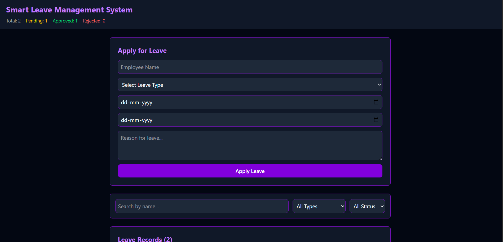
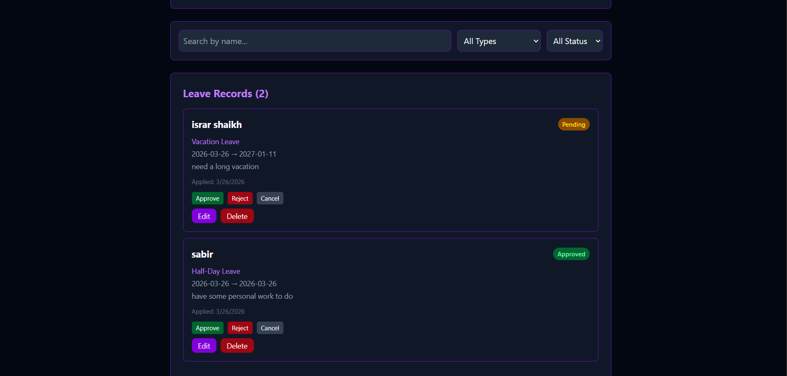

# 🏢 Smart Leave Management System

A React-based leave management application using Redux Toolkit.

## 📝 Project Description

Smart Leave Management System allows employees to apply for leave, manage requests, approve or reject applications, and monitor leave records efficiently using Redux for state management.

## 🧩 Component Structure

- **store.js** — Redux store configuration
- **leaveSlice.js** — Redux slice with actions and reducers
- **AddLeave.jsx** — Apply for leave form
- **LeaveList.jsx** — Display all leave records
- **LeaveCard.jsx** — Single leave card
- **SearchFilter.jsx** — Search and filter leaves
- **Dashboard.jsx** — Main dashboard page

## ⚛️ Tech Stack

- React
- Redux Toolkit
- Redux Thunk
- Tailwind CSS

## 🔥 Features

- Apply for leave
- Approve/Reject/Cancel leave
- Delete leave records
- Search by employee name
- Filter by leave type and status
- Real-time UI updates

## 📸 Screenshots

### Dashboard


### Apply Leave



## ⚙️ How to Run
```bash
npm install
npm run dev
```

## 📌 Notes

- No backend or API used
- State managed with Redux Toolkit