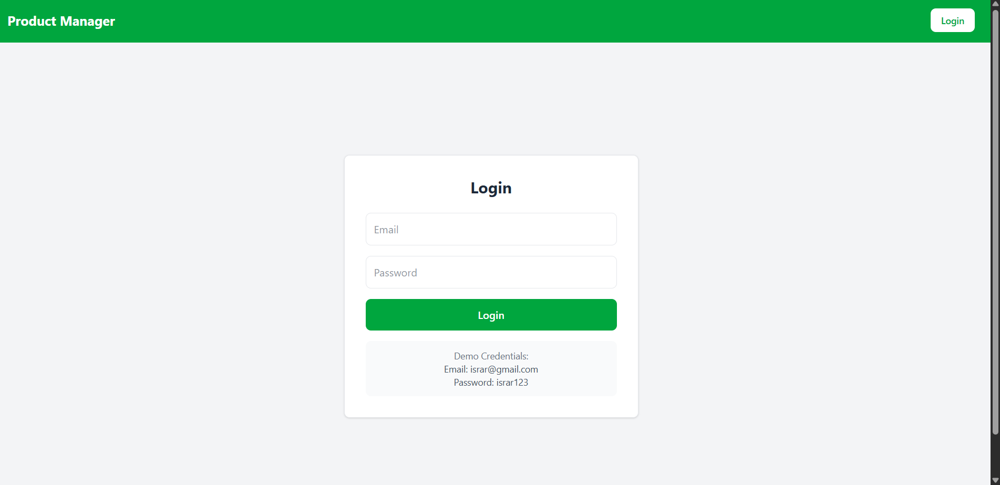
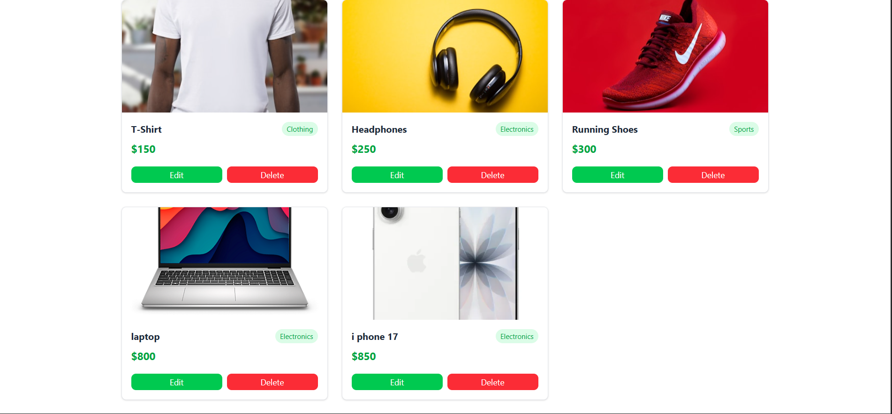
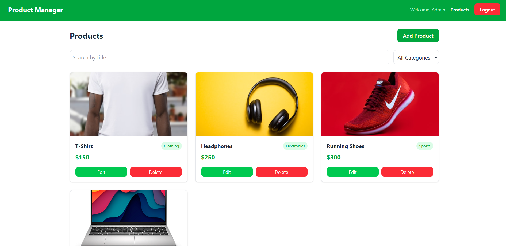
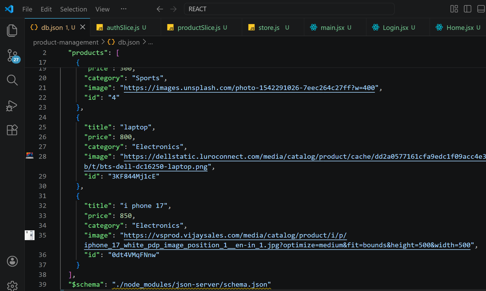

# 🛍️ Product Management App

A React + Redux based product management application.

## 📝 Project Description

Product Management App allows users to manage products with full CRUD operations, search, filter, and sort functionality. Redux Toolkit is used for state management and JSON Server as mock backend.

## 🧩 Component Structure

- **Navbar.jsx** — Navigation bar
- **ProductList.jsx** — Display all products
- **ProductForm.jsx** — Add/Edit products
- **ProductItem.jsx** — Single product card
- **PrivateRoute.jsx** — Protected route

## ⚛️ Tech Stack

- React
- Redux Toolkit
- React Router DOM
- JSON Server
- Tailwind CSS

## 🔥 Features

- Fetch products from JSON Server
- Add new product
- Update existing product
- Delete product
- Search by title
- Filter by category
- Sort by price
- User Authentication
- Protected Routes

## 📸 Screenshots









## ⚙️ How To Run

```bash
npm install
npm run dev
npx json-server db.json --port 3001
```

## 🔐 Demo Credentials

Email: admin@gmail.com
Password: admin123

## 📌 Notes

- JSON Server runs on port 3001
- React app runs on port 5173